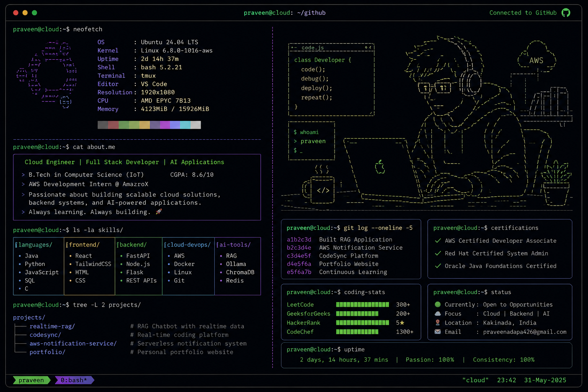

# 📟 Terminal Session: Praveen Adapa

<p align="center">
  
</p>

<p align="center">
  
</p>

```bash
praveenadapa425@github:~$ cat current_status.txt
```
```text
🚧 Currently building: [PLACEHOLDER — ask me what I'm working on now]
```

### 👤 Profile Diagnostics
```bash
praveenadapa425@github:~$ cat about.txt
```
* 🎓 **Education:** B.Tech in Computer Science (IoT) at Aditya College of Engineering & Technology (2023 - 2027) | **CGPA:** 8.6/10
* 🔍 **Current Status:** 4th-year undergraduate student seeking Software Engineering, Backend, and Cloud Developer roles.
* 📍 **Location:** Rajamahendravaram, Andhra Pradesh, India 🇮🇳
* 💡 **Brief Bio:** I am a passionate developer focused on building secure full-stack systems, managing cloud infrastructure, and solving complex algorithmic challenges. ▋

### 🛠️ Tech Stack & Skills
```bash
praveenadapa425@github:~$ tree -L 2 skills/
```
```text
skills/
├── 💻 languages/
│   ├── ☕ Java (Oracle Certified)
│   ├── 🐍 Python
│   ├── 🟨 JavaScript
│   ├── 🐬 SQL
│   └── ⚙️ C
├── 🎨 frontend/
│   ├── ⚛️ React
│   ├── 🌐 Next.js
│   ├── 🖌️ TailwindCSS
│   └── 📄 HTML5 / CSS3
├── ⚙️ backend/
│   ├── ⚡ FastAPI
│   ├── 🟢 Node.js
│   ├── 🌶️ Flask
│   ├── 🔌 REST APIs
│   └── 🔄 WebSockets
├── 💾 databases/
│   ├── 🐬 MySQL
│   ├── 🍃 MongoDB
│   └── 🔥 Firestore
├── ☁️ cloud-devops/
│   ├── 💻 AWS (Certified Developer - Associate)
│   ├── 🐳 Docker
│   ├── 🔴 Redis
│   ├── 🐧 Linux (RHCSA)
│   ├── 🐙 Git
│   └── 📮 Postman
└── 🧠 core-concepts/
    ├── 📐 Data Structures & Algorithms
    ├── ⚙️ OOP
    ├── 🗄️ DBMS
    ├── 💻 Operating Systems
    └── 🕸️ Computer Networks
```

```text
Java        █████████████████░░░  85%
Python      ████████████████░░░░  80%
JavaScript  ███████████████░░░░░  75%
AWS         ██████████████░░░░░░  70%
Docker      █████████████░░░░░░░  65%
SQL         ████████████████░░░░  80%
```

### 💼 Professional Experience
```bash
praveenadapa425@github:~$ cat experience.txt
```
💼 **AWS Cloud Development Intern** @ **Technical Hub Pvt. Ltd.** *(May 2025 – June 2025)*
* Built and optimized cloud architectures using **AWS EC2, S3, Lambda, and IAM**.
* Authored serverless functions automating recurring cloud configurations and resource deployments.
* Enforced least-privilege resource access policies across development and staging environments.

### 🚀 Technical Projects

```bash
praveenadapa425@github:~/projects$ tree -L 2
```

```text
projects/
├── realtime-rag-fastapi/
│   ├── AI-powered document retrieval
│   ├── Real-time token streaming
│   ├── Semantic search
│   └── Dockerized deployment
│
├── codesync/
│   ├── Competitive programming dashboard
│   ├── Firebase authentication
│   ├── Real-time leaderboard
│   └── Responsive UI
│
├── event-driven-notification-service/
│   ├── AWS SNS
│   ├── AWS SQS
│   ├── Docker
│   └── Event-driven architecture
│
└── personal-portfolio/
    ├── React
    ├── Tailwind CSS
    ├── Responsive design
    └── Custom domain

4 directories, 16 files
```

<details open>
<summary><b>📡 Real-Time Streaming RAG Application</b></summary>

Production-ready **Retrieval-Augmented Generation (RAG)** application featuring semantic document search and real-time token streaming using WebSockets.

**Tech Stack:** Python • FastAPI • React • WebSockets • Redis • ChromaDB • Docker • Ollama

🔗 **Repository:**
https://github.com/Praveenadapa425/realtime-rag-fastapi

</details>

<details>
<summary><b>📊 CodeSync – Competitive Programmer's Dashboard</b></summary>

A full-stack dashboard that aggregates competitive programming profiles into a unified interface with authentication and real-time leaderboards.

**Tech Stack:** JavaScript • Node.js • Firebase • Firestore • Tailwind CSS • Vercel

🌐 **Live Demo:**
https://codesync.praveen.qzz.io

🔗 **Repository:**
https://github.com/Praveenadapa425/codesync

</details>

<details>
<summary><b>☁️ Event-Driven Notification Service</b></summary>

Cloud-native notification service demonstrating asynchronous messaging using **AWS SNS** and **AWS SQS** with an event-driven architecture.

**Tech Stack:** AWS SNS • AWS SQS • Docker • Java

🔗 **Repository:**
https://github.com/Praveenadapa425/Event-Driven-Notification-Service-with-AWS-SQS-and-SNS

</details>

<details>
<summary><b>🌐 Personal Portfolio Website</b></summary>

Modern portfolio website showcasing projects, certifications, technical skills, and professional achievements.

**Tech Stack:** React • Tailwind CSS • JavaScript

🌐 **Website:**
https://praveen.qzz.io

🔗 **Repository:**
https://github.com/Praveenadapa425/Personal-Portfolio-Website

</details>

### 🏆 Credentials & Highlights
```bash
praveenadapa425@github:~$ cat accomplishments.txt
```

#### 🥇 Professional Certifications
* ☁️ **AWS Certified Developer - Associate** | [Verify Badges](https://www.credly.com/badges/081db7c4-4e48-4730-8814-1faf9f15c90e/public_url)
* 🐧 **Red Hat Certified System Administrator (RHCSA)** | [Verify Badges](https://www.credly.com/badges/2093c160-d17c-4d68-82bc-6ed638f5fdd6)
* ☕ **Oracle Certified Foundations Associate - Java** | [Verify Badges](https://catalog-education.oracle.com/ords/certview/sharebadge?id=E58302A14D0D57FDBA6C0BCD609E932A761FD5AC096D474637B333C36F66387A)

#### 🧠 Coding Profiles
* 🏆 **LeetCode:** Solved **300+** problems | Rating: **1400+** | [Profile](https://leetcode.com/u/PraveenAdapa/)
* 💻 **GeeksforGeeks:** Solved **200+** problems | [Profile](https://www.geeksforgeeks.org/profile/praveen_adapa42)
* 🔴 **CodeChef:** Rating: **1300+** | [Profile](https://www.codechef.com/users/praveenadapa42)
* 🌟 **HackerRank:** **5 Star** in C, Java, SQL | [Profile](https://www.hackerrank.com/profile/parveenadapa425)

### 📈 GitHub Status
```bash
praveenadapa425@github:~$ curl -s stats/overall
```
<p align="left">
  <a href="https://github.com/Praveenadapa425">
    
  </a>
  <a href="https://github.com/Praveenadapa425">
    
  </a>
</p>

### 📞 Contact & Connection
```bash
praveenadapa425@github:~$ ping -c 4 contact_methods
```
<p align="left">
  <a href="https://www.linkedin.com/in/praveen-adapa-162179290/">
    
  </a>
  <a href="mailto:praveenadapa426@gmail.com">
    
  </a>
  <a href="https://github.com/Praveenadapa425">
    
  </a>
  <a href="#">
    
  </a>
</p>
